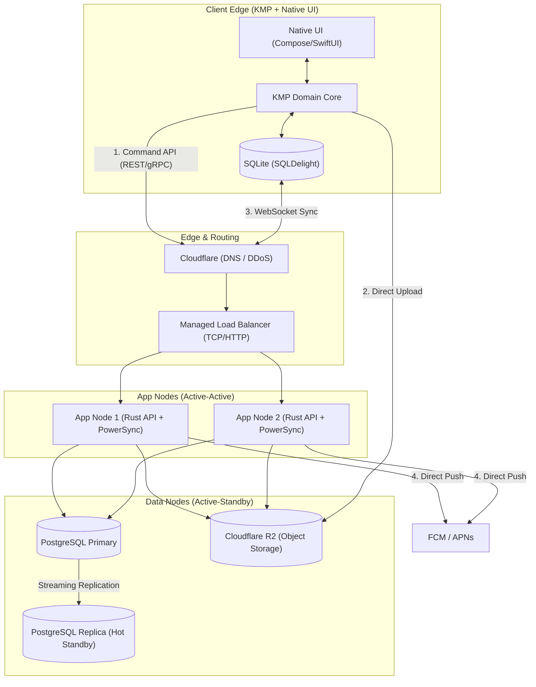

# Justo CP App: Architecture Blueprint

## 1. Non-Functional Requirements (NFRs)

**CRITICAL:** No implementation in any phase should begin until journey screens are ready and the underlying architecture strictly supports these NFRs.

- **Authentication:** Must support MS 365, MS users, Google ID, and Indian phone number-based login (SMS and/or WhatsApp). A self-hosted solution is preferred (e.g., Logto, Zitadel), with the final vendor decision deferred.
- **Target Scale:** 10-20 Requests Per Second (RPS) for the Early-Stage Pilot.
- **Resilience:** Minimal live redundancy for high availability (HA). Zero enterprise bloat, extreme cost-discipline. Must avoid hard Single Point of Failure (SPOF).
- **Offline-First:** Must support a fully secure, offline-first client architecture with active-active API nodes and a warm standby database.

---

## 2. Application Architecture (Lean Startup Model)

### 2.1 Executive Summary & Scale Assessment

At a target scale of 10-20 RPS, deploying enterprise-grade distributed infrastructure (Kafka, Redis Clusters, Managed Kubernetes) is a misallocation of startup capital. However, running a single Virtual Private Server (VPS) introduces a hard SPOF with a 15+ minute recovery time, which violates the requirement for minimal downtime.

**The Solution:** By strategically splitting the compute and data tiers using commodity cloud load balancers and lightweight deployment tooling, we achieve **Live Redundancy** without crossing the enterprise cost threshold. We can deliver a 100% complete, secure, offline-first architecture with active-active API nodes and a warm standby database for **under $30/month** in raw infrastructure costs.

### 2.2 The Tech Stack & Redundancy Strategy

| Component Category | Optimized "Startup" Reality | Live Redundancy Implementation | Monthly Cost Est. (Hetzner/DO) |
| :--- | :--- | :--- | :--- |
| **Routing / Edge** | **Cloudflare (DNS) + Managed LB** | A cheap managed Load Balancer distributes traffic to 2x App Nodes. | ~$6.00 |
| **API Compute** | **2x Small VPS (Rust/Axum)** | Active-Active deployment. If one node dies, the LB seamlessly routes to the survivor. | ~$8.00 ($4 x 2) |
| **Sync Engine** | **2x Self-Hosted PowerSync** | PowerSync runs on both App Nodes, connecting to the Primary DB. | $0.00 (Compute shared) |
| **Cache / Queue** | **PostgreSQL (`SKIP LOCKED`)** | Replaces Redis/Kafka. Postgres handles queues transactionally. | $0.00 (Compute shared) |
| **Database** | **Self-Hosted Postgres 16 (HA)** | 1x Primary DB VPS, 1x Replica DB VPS using streaming replication. | ~$10.00 ($5 x 2) |
| **Object Storage** | **Cloudflare R2** | Multi-region HA by default. Zero egress fees. | ~$0.00 (Free tier) |
| **Notifications** | **FCM (Firebase) + APNs** | Native to KMP. Highly available by Google/Apple. | $0.00 |
| **Deployment Tool** | **Kamal 2** | Replaces Docker Compose. Handles rolling, zero-downtime deploys across the 2 App Nodes natively. | $0.00 |
| **Total Cost** | | **Enterprise Resilience on Commodity Hardware** | **~$24.00 / month** |

### 2.3 End-to-End System Architecture Topology

### 2.4 Data Flow Deep Dives

#### The Write Path (Postgres-Backed Outbox)
1. **Action:** CP Agent submits a lead offline. KMP saves it to the local SQLite outbox.
2. **Sync:** KMP POSTs the batch to the edge. The Load Balancer routes to the healthiest App Node (Rust API).
3. **Idempotency:** Rust attempts to `INSERT` the idempotency key into the Primary Postgres DB. If successful, it mutates tables and commits.
4. **Job Queueing:** Rust inserts a push notification job into the `jobs` table within the same transaction.
5. **Background Processing:** Both App Nodes run Tokio workers polling the `jobs` table using `SELECT ... FOR UPDATE SKIP LOCKED`. Only one worker grabs the job, processes it, and marks it complete.

#### The Read Path (Local-First via Self-Hosted PowerSync)
1. **Connection:** KMP client connects via WebSockets to either App Node running the PowerSync container.
2. **Replication:** PowerSync reads the Postgres WAL from the Primary DB. RLS filters the stream based on the JWT claims.
3. **Failover:** If an App Node crashes, the KMP client's WebSocket drops, auto-reconnects to the LB, and hits the surviving App Node. Sync resumes instantly.

### 2.5 Production Deployment Plan (Kamal & HA)

**Kamal Orchestration:**
We reject Kubernetes (too complex) and Docker Compose (causes blips). We use **Kamal** (formerly MRISK / built by 37signals) to deploy web apps anywhere using raw Docker.
* **Zero-Downtime:** Kamal spins up the new Rust container, waits for it to pass health checks, updates the local Traefik proxy, and gracefully kills the old container.
* **Simplicity:** Managed via a single `deploy.yml` file in your repository.

**Database High Availability:**
* Deploy Postgres 16 on the Primary Node and Replica Node with asynchronous streaming replication.
* In the event of Primary hardware failure, manually promote the Replica to Primary and update the `DATABASE_URL` via Kamal (`kamal env push && kamal app boot`). Downtime is reduced to < 2 minutes.

### 2.6 Operational Risks & Remediation

| Risk | Impact | Pragmatic Remediation (Minimal Downtime) |
| --- | --- | --- |
| **App Node Failure** | Zero downtime. | The Load Balancer routes 100% of traffic to the surviving App Node. |
| **Primary DB Failure** | 1-2 mins downtime. | Promote Hot Standby Replica to Primary. |
| **PowerSync WAL Lag** | Stale data read. | Monitor `pg_stat_replication`. Lag will be <10ms at 20 RPS. |
| **Disk Exhaustion** | Node crash. | Strictly configure Docker log rotation (`max-size: 10m`) and cron jobs to prune tables. |

---

## 3. Planning Framework Architecture (GSD)

### 3.1 Pattern Overview
**Overall:** Artifact-chain document planning project with a Goal-Structured Delivery (GSD) framework.
- Artifact sequence produces BRD -> PRD -> journey maps -> Google Stitch UI screen prompts in lockstep.
- GSD framework provides state tracking, requirements definition, roadmap sequencing, and research artifact management.
- All planning artifacts anchor to source evidence in `Justo_CP_App_Business_Brief.md` and the `docs/` vendor proposals.

### 3.2 Layers
- **Source Evidence Layer:** Grounds all planning claims in vendor proposals, SOWs, and business analysis. Located in `docs/` and `Justo_CP_App_Business_Brief.md`.
- **Extraction Layer:** Makes PDF/Word proposal content machine-readable for reference and search. Located in `.tmp_doc_extract/`.
- **Planning Framework Layer (GSD):** Tracks project state, requirements, roadmap, and research artifacts for the artifact-generation workflow. Located in `.planning/`.
- **Research Layer:** Captures domain analysis, architectural patterns, technology stack assumptions, feature mapping, and risk analysis. Located in `.planning/research/`.
- **Artifact Chain Layer:** Produces the sequential planning deliverables that form the project output (BRD, PRD, Journey Maps, UI Prompts). Located in the project root.
- **Tooling Layer:** Configures the agent toolchain used for artifact generation. Located in `.opencode/`.

### 3.3 Data Flow (Planning)
1. Source evidence is collected into `docs/`.
2. Business analysis written into `Justo_CP_App_Business_Brief.md`.
3. Research artifacts synthesized from source evidence and business brief.
4. BRD drafted from business brief, research artifacts, and GSD requirements.
5. PRD derived from BRD requirements and decisions.
6. Persona-wise journey maps traced from PRD personas and functional requirements.
7. Google Stitch UI screen prompts generated from journey map rows.

### 3.4 Key Abstractions
- **Three Operating Loops:** CP Acquisition & Enablement Loop, Transaction Loop, Trust Loop.
- **Launch MVP Trust Loop:** Verified CP onboarding -> Project access -> Lead protection -> Site-visit proof -> Booking visibility -> Payout status visibility.
- **Personas:** Radically simplified to focus on RM, CP, and Customer (Doc Upload) for MVP.
- **GSD State Machine:** Tracks which artifact is current, what is next, and what decisions are pending in `.planning/STATE.md`.
- **Scope Gatekeeper:** Enforces the Launch MVP boundary.

### 3.5 Error Handling & Cross-Cutting Concerns
- Artifact validation is manual via GSD verifier checks.
- All claims trace to `Justo_CP_App_Business_Brief.md` or `docs/`.
- Every non-trivial claim carries a `[high/moderate/low/unknown]` confidence tag.
- All artifacts use Markdown. Indian locale formatting (Rs, lakh/crore, dd/mm/yyyy, +91 phone) throughout.