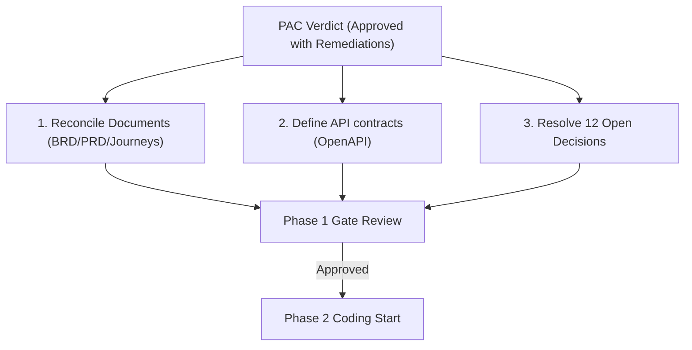

# Product Architecture Council (PAC) Verdict Document — Justo CP App

**Date:** 2026-06-14  
**Project:** Justo CP App Initiative  
**Current Baseline Version:** v0.5  
**Verdict:** Approved with Mandated Remediations (Conditional Gate Passed)

---

## 1. Executive Summary

The Product Architecture Council (PAC) has completed a comprehensive, multi-domain evaluation of the Justo CP App planning artifacts (`Justo_CP_App_Business_Brief.md`, `Justo_CP_App_BRD_Draft.md`, `Justo_CP_App_PRD.md`, `Justo_CP_App_Journey_Maps.md`, `Justo_CP_App_UI_Stitch_Prompts.md`, and `ARCHITECTURE.md`). 

The consolidated council score is **56.0 / 90 (62.2%)**, reflecting **Moderate** architectural and product readiness. While the strategic operating loops and high-availability database designs are excellent, the lack of quantitative metrics, offline data security (local SQLite encryption), Indian data privacy (DPDPA) compliance, and API contracts represent critical gaps that must be remediated.

The PAC has resolved six major architectural contradictions. These verdicts are authoritative and supersede all original v0.5 draft specifications.

---

## 2. Authorized Architectural Verdicts

### Verdict 1: Mobile App UI Limited to 3 Core Personas
* **Decision:** The CP Mobile App UI will be restricted exclusively to **Relationship Manager (RM)**, **CP Owner**, and **CP Employee**.
* **Remediation:** Remove or archive all other mobile workflows. Back-office and support roles (Leadership, Sourcing Head, Finance, Ops/Admin, Compliance, and Telecallers) will perform their work within custom desktop interfaces on the existing **Project Manthan CRM Portal**. 
* **Buyer Flow:** The Customer/Buyer document upload journey will be implemented as a lightweight, SMS-triggered mobile web form, avoiding any mobile app registration or shell.

### Verdict 2: Consolidate Backend Stack on TypeScript/NestJS
* **Decision:** The backend API compute tier framework is changed from Rust (Axum) to **Node.js/NestJS**.
* **Remediation:** This aligns the compute tier language (TypeScript) with the existing Project Manthan developer capabilities, allowing code reuse and maximizing sprint velocity. The load-balanced active-active VPS deployment using Traefik and Kamal 2 is retained.

### Verdict 3: Secure Offline Local Storage (SQLCipher & 24-Hr TTL)
* **Decision:** The offline SQLite database cache on client devices must be encrypted using **SQLCipher**.
* **Remediation:** SQLCipher encryption keys must be stored in the device hardware KeyStore/Keychain. The local session key must expire and require re-authentication every 24 hours. A remote wipe command must trigger an immediate local database wipe upon user suspension.

### Verdict 4: Implement DPDPA 2023 Consent Gate & Privacy Hashing
* **Decision:** The CP onboarding and Buyer lead registration flows must incorporate explicit, loggable consent gateways.
* **Remediation:** Establish a secure, append-only `consent_logs` table. Ensure all lead phone numbers and PII sent to analytics tracking systems (PostHog/Mixpanel) are hashed using SHA-256 server-side.

### Verdict 5: Accessibility-Compliant Interactive Color Palettes
* **Decision:** The interactive design system primary color will be adjusted from lime green (`#b8ff4d`) to a high-contrast **Teal or Dark Green** to satisfy WCAG AA contrast guidelines.
* **Remediation:** Restrict the lime green color strictly to decorative accents and status dots.

### Verdict 6: Establish Decentro Bank Account Penny-Drop Verification
* **Decision:** To prevent payout fraud and financial leaks, all CP bank account modifications must trigger a Decentro penny-drop validation check.
* **Remediation:** Validate that the registered account holder name matches the RERA/PAN certificate. Payout processing must implement a strict maker-checker validation flow on the desktop admin portal.

---

## 3. PAC Action Plan & Gating Criteria

No implementation (Phase 2 coding) may begin until the following Phase 1 deliverables are completed, audited, and approved:

### Action Items for Product & Engineering:
1. **Document Sync:** Update the primary documents (`Justo_CP_App_BRD_Draft.md`, `Justo_CP_App_PRD.md`, `Justo_CP_App_Journey_Maps.md`, and `Justo_CP_App_UI_Stitch_Prompts.md`) to reflect the simplified 3-persona scope and WCAG-compliant colors.
2. **API Specification:** Draft the OpenAPI/Swagger contracts for the Node.js/NestJS backend to share with the KMP client team.
3. **Decisions Resolution:** Run a 2-day stakeholder workshop to assign owners and resolve the 12 Open Decisions (lead-lock duration, payout SLA, geofence radius limits) listed in BRD §14.
4. **Developer Setup:** Create a `DEVELOPER.md` guide and local docker-compose configurations containing PostgreSQL and local PowerSync sync stubs.

---

*Verdict authorized by the Product Architecture Council Coordinator | 2026-06-14*
