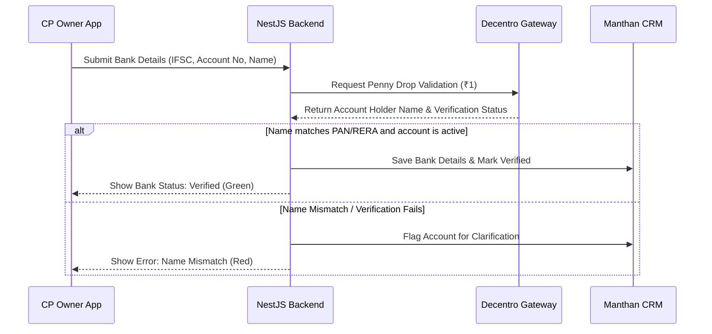

# Regulatory & Compliance Deep-Dive — Product Architecture Council

## 1. Executive Summary

The Justo CP App operates in a highly regulated domain within India, subject to three primary regulatory and compliance regimes:
1. **MahaRERA (Maharashtra Real Estate Regulatory Authority):** Governs CP broker registrations, project advertising, and lead/site visit attribution.
2. **DPDPA 2023 (Digital Personal Data Protection Act, India):** Dictates how user and customer PII (Personal Identifiable Information) must be collected, processed, stored, and deleted.
3. **Indian Tax & Financial Regulations:** Governs GST compliance, TDS (Tax Deducted at Source) deductions on broker commissions, and banking validations.

This document details the concrete engineering and product requirements to satisfy these compliance bounds in the Launch MVP.

---

## 2. DPDPA 2023 Compliance Blueprint

The Digital Personal Data Protection Act of 2023 is active and strictly enforced. Any platform processing Indian citizens' personal data must implement secure-by-design consent mechanisms.

### A. The Consent Lifecycle
* **CP Registration:** The CP Owner and CP Employees must review and accept an explicit, itemized Privacy Notice before submitting profiles.
* **Buyer Lead Ingestion:** When a CP agent registers a buyer lead, they are submitting a third party's PII (name, phone, email). Justo must obtain the buyer's consent.
* **The Buyer Consent Flow:**
  1. Upon lead registration by the CP, the system automatically sends a transactional SMS/WhatsApp message to the buyer:  
     *"Hello [Buyer Name], Channel Partner [CP Name] has registered you as a lead for Project [Project Name] with Justo. Please click here [Link] to view our privacy policy and consent to data processing."*
  2. The link opens a lightweight mobile web page showing the consent terms.
  3. Until the Buyer clicks "Approve", the lead remains in a `PENDING_CONSENT` state in Project Manthan. RMs and sales executives cannot call the buyer, and the lead lock is not finalized.
  4. Once approved, the state shifts to `ACTIVE_LOCK` and the consent event is logged.

### B. Consent Log Schema (PostgreSQL)
All consent events must be logged in a write-once, append-only table for audit verification:
```sql
CREATE TABLE consent_logs (
    id UUID PRIMARY KEY DEFAULT gen_random_uuid(),
    actor_id UUID NOT NULL,               -- User or Lead ID
    actor_type VARCHAR(20) NOT NULL,      -- 'CP_OWNER', 'CP_EMPLOYEE', 'BUYER'
    consent_notice_version VARCHAR(10) NOT NULL, -- e.g., 'v1.0'
    action_type VARCHAR(10) NOT NULL,     -- 'GRANTED', 'WITHDRAWN'
    ip_address VARCHAR(45) NOT NULL,      -- IPv4/IPv6
    device_fingerprint TEXT,
    timestamp TIMESTAMP WITH TIME ZONE DEFAULT CURRENT_TIMESTAMP NOT NULL
);
CREATE INDEX idx_consent_actor ON consent_logs(actor_id, action_type);
```

### C. Right to Erasure (The Data Deletion Flow)
* Users (CPs) and Buyers must have an interface to request account/data deletion.
* Upon validation, the system must trigger a delete pipeline:
  1. Purge the SQLite cache on the client device (forces remote wipe on next sync).
  2. Anonymize database records in PostgreSQL (nullify names, emails, and replace phone numbers with unique hashed identifiers) to preserve transaction metrics without holding PII.
  3. Retain financial transaction records (bookings, invoices, payouts) under India's IT Act and Tax laws (which mandate 8 years of financial record retention, superseding DPDPA deletion rights).

---

## 3. MahaRERA Compliance Strategy

Under MahaRERA guidelines, real estate brokers must be registered, and developers can only pay commissions to registered agents for approved projects.

### A. CP RERA Verification
* During CP onboarding, the CP Owner must upload their MahaRERA registration certificate and input their RERA number (e.g., `A519000XXXXX`).
* **Validation Check:** The Compliance Team must verify the RERA number against the public MahaRERA database before changing the CP status to `APPROVED`.
* **RERA Expiry Alerts:** The PRD must mandate an automated cron job that scans RERA expiry dates 60 days, 30 days, and 7 days prior to expiration, sending in-app notifications to both the CP Owner and the RM.
* **Automatic Suspension:** If a RERA certificate expires, the CP firm's status automatically transitions to `COMPLIANCE_SUSPENDED`, blocking new lead submissions and site visit scheduling.

### B. Project RERA Display
* Every project detail screen in the CP App must prominently display the project's MahaRERA registration number and a link to the official MahaRERA project certificate PDF.
* Collateral share sheets must include the project's MahaRERA number on all shared files, brochures, or images to prevent regulatory fines for unauthorized advertising.

---

## 4. KYC & Financial Verification Architecture

To prevent payout leaks, tax evasion, and identity fraud, the CP App integration layer must validate KYC and banking data before any financial transactions occur.



### A. KYC Validation Pipeline
1. **PAN Card Verification:** Integration with a PAN verification API (e.g., Decentro / Karza) to verify that the CP Owner's PAN is active and matching the firm registration name.
2. **GSTIN Verification:** If the CP firm is GST-registered, validate the GSTIN to pull legal name, address, and filing status, ensuring tax invoices can be legally processed.

### B. Payout TDS & GST Rules
* The NestJS finance module must calculate TDS deductions automatically on all commissions based on the CP's registration type:
  * **Individual CP (No GST):** Deduct TDS under Section 194H (typically 5%). Payout = Gross Commission - 5% TDS.
  * **Corporate/Registered CP (GST):** Require CP to upload a tax invoice showing GST (typically 18%). Payout = Gross Commission + 18% GST - applicable TDS.
* The CP Owner finance screen must display these deductions clearly on the payout detail view to maintain complete financial transparency and prevent disputes.

---

*Compliance Blueprint approved by the Product Architecture Council | 2026-06-14*
