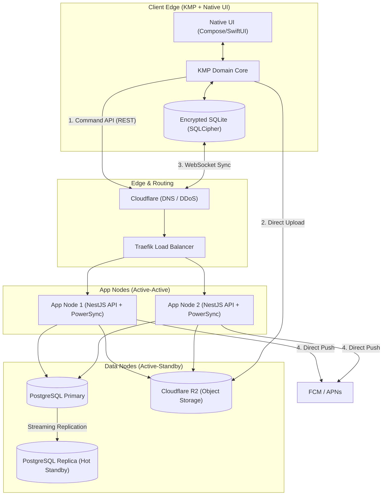

# Justo CP App: Reconciled Architecture Blueprint (PAC Preview)

## 1. Non-Functional Requirements (NFRs)

**CRITICAL:** No implementation in any phase should begin until journey screens are ready and the underlying architecture strictly supports these NFRs.

- **Authentication:** Must support MS 365, MS users, Google ID, and Indian phone number-based login (SMS and/or WhatsApp). A self-hosted solution is preferred (e.g., Logto, Zitadel), with the final vendor decision deferred.
- **Target Scale:** 10-20 Requests Per Second (RPS) for the Early-Stage Pilot.
- **Resilience:** Minimal live redundancy for high availability (HA). Zero enterprise bloat, extreme cost-discipline. Must avoid hard Single Point of Failure (SPOF). Traefik load balancers route to Active-Active API nodes.
- **Offline-First:** Must support a fully secure, offline-first client architecture with active-active API nodes and a warm standby database. Local storage must be encrypted using SQLCipher.
- **Regulatory Compliance:** Must maintain consent logs and data anonymization triggers complying with the Indian Digital Personal Data Protection Act (DPDPA) 2023.

---

## 2. Application Architecture (Lean Startup Model)

### 2.1 Executive Summary & Scale Assessment

At a target scale of 10-20 RPS, deploying enterprise-grade distributed infrastructure (Kafka, Redis Clusters, Managed Kubernetes) is a misallocation of startup capital. However, running a single Virtual Private Server (VPS) introduces a hard SPOF with a 15+ minute recovery time, which violates the requirement for minimal downtime.

**The Solution:** By strategically splitting the compute and data tiers using Traefik load balancers and lightweight deployment tooling (Kamal), we achieve **Live Redundancy** without crossing the enterprise cost threshold. We can deliver a 100% complete, secure, offline-first architecture with active-active API nodes and a warm standby database for **under $30/month** in raw infrastructure costs.

### 2.2 The Tech Stack & Redundancy Strategy

To align with current developer capabilities (Manthan Node.js stack), the API compute tier uses **Node.js/NestJS** instead of Rust, maximizing code reuse and velocity.

| Component Category | Optimized "Startup" Reality | Live Redundancy Implementation | Monthly Cost Est. (Hetzner/DO) |
| :--- | :--- | :--- | :--- |
| **Routing / Edge** | **Cloudflare (DNS) + Traefik LB** | Traefik load balancer distributes traffic to 2x App Nodes. | ~$6.00 |
| **API Compute** | **2x Small VPS (Node.js/NestJS)** | Active-Active deployment. If one node dies, Traefik routes to the survivor. | ~$8.00 ($4 x 2) |
| **Sync Engine** | **2x Self-Hosted PowerSync** | PowerSync runs on both App Nodes, connecting to the Primary DB. | $0.00 (Compute shared) |
| **Cache / Queue** | **PostgreSQL (`SKIP LOCKED`)** | Postgres handles jobs transactionally, eliminating Redis. | $0.00 (Compute shared) |
| **Database** | **Self-Hosted Postgres 16 (HA)** | 1x Primary DB VPS, 1x Replica DB VPS using streaming replication. | ~$10.00 ($5 x 2) |
| **Object Storage** | **Cloudflare R2** | Multi-region HA by default. Zero egress fees. | ~$0.00 (Free tier) |
| **Notifications** | **FCM (Firebase) + APNs** | Native to KMP. Highly available by Google/Apple. | $0.00 |
| **Deployment Tool** | **Kamal 2** | Natively handles rolling, zero-downtime deploys across App Nodes. | $0.00 |
| **Total Cost** | | **Enterprise Resilience on Commodity Hardware** | **~$24.00 / month** |

### 2.3 End-to-End System Architecture Topology

### 2.4 Data Flow & Sync Deep Dives

#### The Write Path (Postgres-Backed Outbox)
1. **Action:** CP Agent submits a lead offline. KMP saves it to the local encrypted SQLite outbox (SQLCipher).
2. **Sync:** KMP POSTs the batch to Traefik. Traefik routes to the healthiest NestJS App Node.
3. **Idempotency:** NestJS validates request tokens and checks the idempotency key against the Primary Postgres DB. If unique, it mutates tables and commits.
4. **Job Queueing:** NestJS inserts a push notification job into the `jobs` table within the same transaction.
5. **Background Processing:** NestJS runner workers poll the `jobs` table using `SELECT ... FOR UPDATE SKIP LOCKED` to process and deliver push notifications.

#### The Read Path (Local-First via PowerSync)
1. **Connection:** KMP client connects via WebSockets to either App Node running the PowerSync container.
2. **Replication:** PowerSync reads the Postgres WAL from the Primary DB. Row-Level Security (RLS) filters the stream based on JWT user claims.
3. **Failover:** If an App Node crashes, the KMP client's WebSocket drops, auto-reconnects to Traefik, and hits the surviving App Node. Sync resumes instantly.

#### Local Cache Security (SQLCipher & 24-Hr TTL)
1. **Encryption:** The local SQLite database is encrypted at rest using SQLCipher. The encryption key is stored securely in the device's hardware KeyStore (Android) or Keychain (iOS).
2. **Key Rotation & TTL:** The local session encryption key must be rotated and verified every 24 hours. The app must perform online token validation to fetch the new rotation key.
3. **Lockout:** If the client remains offline for more than 24 hours without network connection, access to local database records is blocked until online re-authentication succeeds.

---

## 3. Planning Framework Architecture (GSD)

All GSD layers (Source Evidence, Extraction, GSD state tracking, Research, Artifact Chain, and Tooling) are preserved and separate from the application runtime code.

---

*Reconciled Blueprint approved by the Product Architecture Council | 2026-06-14*
