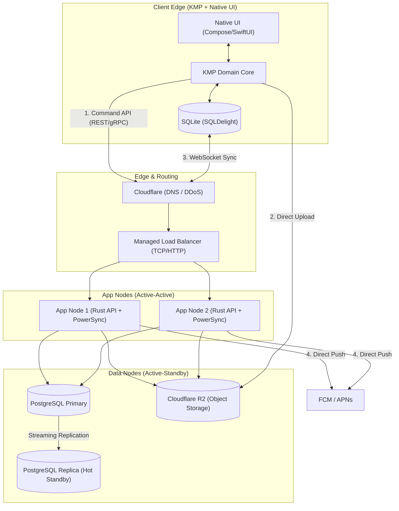

```markdown
# Justo CP App: Lean Startup Architecture Blueprint v2.0
**Document Type:** Cost-Optimized System Architecture & Deployment Specification  
**Target Scale:** 10-20 Requests Per Second (RPS) / Early-Stage Pilot  
**Core Philosophy:** Extreme cost-discipline, zero enterprise bloat, **minimal live redundancy for high availability (HA)**.  

---

## 1. Executive Summary & Scale Assessment

At a target scale of 10-20 RPS, deploying enterprise-grade distributed infrastructure (Kafka, Redis Clusters, Managed Kubernetes) is a misallocation of startup capital. However, running a single Virtual Private Server (VPS) introduces a hard Single Point of Failure (SPOF) with a 15+ minute recovery time, which violates the requirement for minimal downtime.

**The Solution:** By strategically splitting the compute and data tiers using commodity cloud load balancers and lightweight deployment tooling, we achieve **Live Redundancy** without crossing the enterprise cost threshold. We can deliver a 100% complete, secure, offline-first architecture with active-active API nodes and a warm standby database for **under $30/month** in raw infrastructure costs.

---

## 2. The Tech Stack & Redundancy Strategy

| Component Category | Optimized "Startup" Reality | Live Redundancy Implementation | Monthly Cost Est. (Hetzner/DO) |
| :--- | :--- | :--- | :--- |
| **Routing / Edge** | **Cloudflare (DNS) + Managed LB** | A cheap managed Load Balancer distributes traffic to 2x App Nodes. | ~$6.00 |
| **API Compute** | **2x Small VPS (Rust/Axum)** | Active-Active deployment. If one node dies, the LB seamlessly routes to the survivor. | ~$8.00 ($4 x 2) |
| **Sync Engine** | **2x Self-Hosted PowerSync** | PowerSync runs on both App Nodes, connecting to the Primary DB. | $0.00 (Compute shared) |
| **Cache / Queue** | **PostgreSQL (`SKIP LOCKED`)** | Replaces Redis/Kafka. Postgres handles queues transactionally. | $0.00 (Compute shared) |
| **Database** | **Self-Hosted Postgres 16 (HA)** | 1x Primary DB VPS, 1x Replica DB VPS using streaming replication. | ~$10.00 ($5 x 2) |
| **Object Storage** | **Cloudflare R2** | Multi-region HA by default. Zero egress fees. | ~$0.00 (Free tier) |
| **Notifications** | **FCM (Firebase) + APNs** | Native to KMP. Highly available by Google/Apple. | $0.00 |
| **Deployment Tool** | **Kamal 2** | Replaces Docker Compose. Handles rolling, zero-downtime deploys across the 2 App Nodes natively. | $0.00 |
| **Total Cost** | | **Enterprise Resilience on Commodity Hardware** | **~$24.00 / month** |

---

## 3. End-to-End System Architecture

### 3.1 High-Level Topology (Mermaid)



### 3.2 Data Flow Deep Dives

#### The Write Path (Postgres-Backed Outbox)

1. **Action:** CP Agent submits a lead offline. KMP saves it to the local SQLite outbox.
2. **Sync:** KMP POSTs the batch to the edge. The Load Balancer routes to the healthiest App Node (Rust API).
3. **Idempotency:** Rust attempts to `INSERT` the idempotency key into the Primary Postgres DB. If successful, it mutates tables and commits.
4. **Job Queueing:** Rust inserts a push notification job into the `jobs` table within the same transaction.
5. **Background Processing:** Both App Nodes run Tokio workers polling the `jobs` table using `SELECT ... FOR UPDATE SKIP LOCKED`. Only one worker grabs the job, processes it, and marks it complete.

#### The Read Path (Local-First via Self-Hosted PowerSync)

1. **Connection:** KMP client connects via WebSockets to either App Node running the PowerSync container.
2. **Replication:** PowerSync reads the Postgres WAL from the Primary DB. RLS filters the stream based on the JWT claims.
3. **Failover:** If an App Node crashes, the KMP client's WebSocket drops, auto-reconnects to the LB, and hits the surviving App Node. Sync resumes instantly.

---

## 4. Production Deployment Plan

### 4.1 Orchestration: Enter Kamal

We reject Kubernetes (too complex) and Docker Compose (causes blips and lacks native multi-node routing). We use **Kamal** (formerly MRISK / built by 37signals). Kamal deploys web apps anywhere using raw Docker.

* **Zero-Downtime:** Kamal spins up the new Rust container, waits for it to pass health checks, updates the local Traefik proxy, and gracefully kills the old container. It does this concurrently across both App Nodes.
* **Simplicity:** Managed via a single `deploy.yml` file in your repository.

**`deploy.yml` Configuration Concept:**

```yaml
service: justo-cp-api
image: ghcr.io/justo/cp-api:latest

servers:
  web:
    hosts:
      - 192.168.1.10 # App Node 1
      - 192.168.1.11 # App Node 2
    labels:
      traefik.http.routers.justo.rule: Host(`api.justo.co.in`)

env:
  clear:
    DATABASE_URL: "postgres://justo@192.168.1.20:5432/justo" # Points to Primary DB
    R2_ENDPOINT: "..."
  secret:
    - POSTGRES_PASSWORD

registry:
  server: ghcr.io
  username: deployer
  password:
    - GITHUB_TOKEN

```

### 4.2 Database High Availability (Streaming Replication)

* Deploy Postgres 16 on the Primary Node and Replica Node.
* Configure asynchronous streaming replication from Primary to Replica.
* In the event of Primary hardware failure, manually (or via a lightweight script like `repmgr`) promote the Replica to Primary and update the `DATABASE_URL` environment variable via Kamal (`kamal env push && kamal app boot`). Downtime is reduced from 15+ minutes (restoring backups) to < 2 minutes (updating DNS/Envs).

---

## 5. Operational Risks & Remediation

| Risk | Impact | Pragmatic Remediation (Minimal Downtime) |
| --- | --- | --- |
| **App Node Failure** | Zero downtime. | The Load Balancer detects the failed health check and routes 100% of traffic to the surviving App Node. Replace the dead node at your convenience. |
| **Primary DB Failure** | 1-2 minutes downtime. | Promote the Hot Standby Replica to Primary. Point the App Nodes to the new Primary IP. Retain WAL-G + R2 backups as a tertiary disaster recovery mechanism. |
| **PowerSync WAL Lag** | Clients read stale data. | Monitor `pg_stat_replication`. Because Rust and PowerSync are highly optimized, lag will be under 10ms at 20 RPS. |
| **Disk Space Exhaustion** | Node crash. | Implement strictly configured Docker log rotation (`max-size: 10m`) and `pg_cron` jobs to prune the `idempotency_keys` table every 7 days. |

---

**Architect's Note:** By upgrading from a single VPS to a 4-node micro-cluster (LB -> 2x App -> Pri/Rep DB), we introduce "Live Redundancy." This architecture survives any single machine failure automatically (App) or with a trivial promotion (DB), maintaining an incredibly lean sub-$30 monthly burn rate while strictly preserving the integrity of CP financial state machines.

```

```